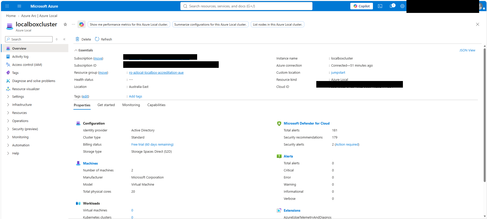

# Azure LocalBox Lab Walkthrough

## Purpose

This document records the verified implementation steps for Accreditation Activity 3: Azure Local proof of concept using Microsoft Azure Arc Jumpstart LocalBox.

The governing scope and customer scenario remain in `docs/00_Accreditation_Scope_and_Customer_Scenario_Source_of_Truth.md`.

This walkthrough records only actions that were actually executed and verified.

---

## 1. Official Microsoft LocalBox Source

The official Microsoft repository used for the lab is:

https://github.com/microsoft/azure_arc

The implementation is pinned to:

```text
3f433866757688d926ae6707e9c0041d8e640b82
```

Commit description:

```text
Update LocalBox to use image version 2608 (#3521)
```

LocalBox Bicep path:

```text
azure_jumpstart_localbox/bicep
```

The exact commit was also used as the LocalBox runtime `githubBranch` value so downloaded automation artifacts remain aligned to the tested source revision.

Status: **PASS**.

---

## 2. Validated Workstation Tooling

Verified execution baseline:

```text
PowerShell 7.6.5
Git 2.55.0.windows.5
Azure CLI 2.89.1
Bicep CLI 0.46.1
Az.Accounts 5.5.2
Az.Resources 10.2.0
```

Azure CLI operational validation also required the following extensions:

```text
customlocation
stack-hci-vm
```

The accreditation repository and Microsoft repository are maintained separately.

Status: **PASS**.

---

## 3. Australia East Deployment Configuration

The verified deployment configuration is:

| Parameter | Verified value |
| --- | --- |
| Resource group | `rg-azlocal-localbox-accreditation-aue` |
| Azure resource location | `australiaeast` |
| Azure Local instance location | `australiaeast` |
| LocalBox host VM size | `Standard_E32s_v5` |
| LocalBox host VM | `LocalBox-Client` |
| `deployBastion` | `false` |
| `autoDeployClusterResource` | `true` |
| `autoUpgradeClusterResource` | `false` |
| `enableAzureSpotPricing` | `false` |
| `vmAutologon` | `true` |
| Runtime source | exact pinned Microsoft commit |

Secrets, tenant identifiers, subscription identifiers, service-principal object identifiers, passwords, and tokens are intentionally excluded from this public repository.

Status: **PASS**.

---

## 4. LocalBox Architecture: One Azure VM, Nested Azure Local Nodes

LocalBox does not deploy two separate Azure IaaS VMs for the two Azure Local nodes.

The outer Azure resource is one VM:

```text
LocalBox-Client
```

Inside `LocalBox-Client`, Hyper-V provides nested virtualization and LocalBox creates:

```text
Azure Subscription
|
+-- LocalBox-Client
    Azure IaaS VM
    |
    +-- Hyper-V / Nested Virtualization
        |
        +-- AzLMGMT
        |   Management VM
        |
        +-- AzLHOST1
        |   Azure Local Node 1
        |
        +-- AzLHOST2
            Azure Local Node 2
```

### Why LocalBox uses this model

LocalBox is a lab and sandbox implementation. A single sufficiently large Azure VM supplies the compute, storage, networking, and nested virtualization capacity required to emulate an Azure Local environment. The Azure Local nodes are then created as nested Hyper-V VMs.

This allows engineers to exercise Azure Local deployment, Azure Arc integration, cluster validation, management, and lifecycle scenarios without requiring separate physical Azure Local servers for the lab.

This is not the production Azure Local deployment model. Production Azure Local runs on supported and validated physical Azure Local hardware.

### Microsoft source references

Outer Azure VM definition:

https://github.com/microsoft/azure_arc/blob/3f433866757688d926ae6707e9c0041d8e640b82/azure_jumpstart_localbox/bicep/host/host.bicep

Nested VM configuration:

https://github.com/microsoft/azure_arc/blob/3f433866757688d926ae6707e9c0041d8e640b82/azure_jumpstart_localbox/artifacts/PowerShell/LocalBox-Config.psd1

Nested Azure Local node creation:

https://github.com/microsoft/azure_arc/blob/3f433866757688d926ae6707e9c0041d8e640b82/azure_jumpstart_localbox/artifacts/PowerShell/New-LocalBoxCluster.ps1

Status: **PASS**.

---

## 5. LocalBox Host Deployment

The LocalBox host deployment completed successfully in Australia East.

Verified Azure resources include:

- `LocalBox-Client`
- `LocalBox-Client-OSDisk`
- `LocalBox-Client-DataDisk_0` through `_7`
- `LocalBox-Client-NIC`
- `LocalBox-Client-PIP`
- `LocalBox-VNet`
- `LocalBox-NSG`
- Log Analytics workspace
- staging storage account
- `Bootstrap` VM extension

The host VM was verified running and the Bootstrap extension reached `Succeeded`.

Status: **PASS**.

---

## 6. Bootstrap, Reboot and Hyper-V Readiness

Bootstrap installed the required tooling and Hyper-V role. Hyper-V installation required a reboot before the LocalBox logon workflow could continue.

Post-reboot checks confirmed:

```text
Hyper-V InstallState : Installed
LocalBoxLogonScript   : Running
```

Relevant logs were created under:

```text
C:\LocalBox\Logs
```

including:

```text
Bootstrap.log
LocalBoxLogonScript.log
New-LocalBoxCluster.log
```

Status: **PASS**.

---

## 7. Nested Azure Local Environment Creation

`New-LocalBoxCluster.ps1` created and configured the nested LocalBox environment.

The Microsoft workflow includes eleven high-level stages:

1. Download LocalBox VHDs.
2. Prepare the Azure VM virtualization host.
3. Create the management VM.
4. Create Azure Local node VMs.
5. Start nested VMs.
6. Configure networking and storage.
7. Build the router VM.
8. Build the domain controller VM.
9. Prepare the Azure Local cluster cloud deployment.
10. Validate the Azure Local cluster deployment.
11. Deploy the Azure Local cluster.

Arc registration for the nested environment succeeded before final cluster deployment.

Status: **PASS**.

---

## 8. Mandatory Resource Provider Readiness

The LocalBox workflow checks these mandatory providers before Azure Local cluster validation:

```text
Microsoft.KubernetesConfiguration
Microsoft.ExtendedLocation
Microsoft.HybridContainerService
Microsoft.HybridCompute
Microsoft.AzureStackHCI
Microsoft.ResourceConnector
Microsoft.Kubernetes
Microsoft.EdgeMarketplace
```

LocalBox attempts to register missing providers automatically, but provider registration is asynchronous and can take longer than the script polling window.

During validation, `Microsoft.HybridContainerService` had not completed registration and Azure Local Arc Integration validation correctly failed.

The following providers were explicitly registered and monitored until they reached `Registered`:

```text
Microsoft.HybridContainerService
Microsoft.EdgeMarketplace
```

Final state for all mandatory providers: **Registered**.

Status: **PASS AFTER REMEDIATION**.

---

## 9. Azure Local Cluster Validation

The validation deployment is:

```text
localcluster-validate
```

The first strict Environment Validator run identified the incomplete resource-provider registration at the Azure Local Arc Integration step.

After provider readiness was corrected, only the failed validation was retried using the already-generated LocalBox ARM files:

```text
C:\LocalBox\azlocal.json
C:\LocalBox\azlocal.parameters.json
```

Verified result:

```text
DeploymentName    : localcluster-validate
ProvisioningState : Succeeded
```

The final validation status subsequently showed success across the Azure Local validation stages, including Remote Management, Connectivity, Active Directory, Hardware, Networking, Observability, Software, MOC Stack, Arc Integration, Cluster Witness, DNS, NTP, Cluster Validation, LLDP and Storage Validation.

Status: **PASS**.

---

## 10. Azure Local Cluster Deployment

The actual cluster deployment is:

```text
localcluster-deploy
```

The deployment was triggered using the generated LocalBox ARM template and parameter file.

The VM Run Command wrapper timed out while waiting for the long-running operation. That timeout did not represent Azure Local deployment failure. The authoritative Azure Resource Manager deployment continued independently.

Final outer deployment result:

```text
State    : Succeeded
Duration : approximately 2 hours 19 minutes
Error    : null
```

Direct `deploymentSettings/default` inspection also confirmed:

```text
provisioningState          : Succeeded
deploymentMode             : Deploy
deploymentStatus.status    : Success
validationStatus.status    : Success
```

Both Azure Local nodes were present as Arc-enabled machine resources:

```text
AzLHOST1
AzLHOST2
```

Status: **PASS**.

---

## 11. Final Azure Local Connectivity

Final Azure-side cluster state:

```text
ConnectivityStatus : Connected
ProvisioningState  : Succeeded
Status             : ConnectedRecently
```

This confirms that the Azure Local cluster is not only provisioned as an ARM resource but operationally connected to Azure.

Status: **PASS**.

---

## 12. Portal Validation Evidence

Azure Portal access was validated after the cluster deployment completed. The Azure Local resource was opened through the Azure Arc supported-environments experience and the deployed system was visible as `localboxcluster`.

Verified portal observations include:

- Azure Local system name: `localboxcluster`.
- Azure connection state: connected.
- Azure region: Australia East.
- Machine count: `2`.
- Azure Local updates state: `Up to date` at the time of capture.
- Cluster overview and management experience accessible from Azure Portal.
- Workload virtual machine count remained `0` at this checkpoint because VM lifecycle validation had not yet started.

### Sanitized portal evidence



*Figure 1. Sanitized Azure Local cluster overview showing the deployed `localboxcluster` management experience without exposing subscription or account identifiers.*


*Figure 2. Historical sanitized Azure Local portal snapshot; not the current update state or proof of a completed update run.*

The source screenshots were sanitized before being committed to the public repository. Full subscription IDs, account identifiers, tenant identifiers, credentials, and other sensitive values are intentionally excluded.

Status: **PASS**.

---

## 13. Layered LocalBox Networking

Network discovery showed that LocalBox uses several distinct network layers. They must not be treated as one flat address space.

| Network | Purpose |
| --- | --- |
| `172.16.1.0/24` | Outer Azure subnet used by `LocalBox-Client` |
| `192.168.1.0/24` | Azure Local infrastructure and management network |
| `192.168.128.0/24` | LocalBox host NAT transport network |
| `192.168.46.0/24` | LocalBox NAT/router routing subnet |
| `192.168.200.0/24` | Azure Local workload VM network, VLAN 200 |

The pinned Microsoft `LocalBox-Config.psd1` confirms the workload VM values:

```text
vmGateway  = 192.168.200.1
vmIpPrefix = 192.168.200.0/24
vmDNS      = 192.168.1.254
vmVLAN     = 200
```

It separately defines `natHostSubnet = 192.168.128.0/24` and `natSubnet = 192.168.46.0/24`, confirming that those ranges are LocalBox transport/routing networks rather than the workload VM subnet.

Status: **PASS**.

---

## 14. Logical Workload Network Validation

The workload logical network was created through Azure Portal so the field mappings and operational workflow could be validated directly.

Verified configuration:

| Setting | Value |
| --- | --- |
| Logical network name | `localbox-vm-lnet-vlan200` |
| Custom location | `jumpstart` |
| VM switch | `ConvergedSwitch(compute_management)` |
| IP assignment | Static |
| IPv4 address space | `192.168.200.0/24` |
| Gateway | `192.168.200.1` |
| DNS | `192.168.1.254` |
| VLAN | `200` |

These values align with the pinned Microsoft LocalBox configuration and `Configure-VMLogicalNetwork.ps1` source.

Backend validation used:

```powershell
az stack-hci-vm network lnet show `
  --resource-group "rg-azlocal-localbox-accreditation-aue" `
  --name "localbox-vm-lnet-vlan200" `
  --query "{Name:name,State:properties.provisioningState,Type:properties.networkType,VMSwitch:properties.vmSwitchName,DNS:properties.dhcpOptions.dnsServers,Subnets:properties.subnets}" `
  --output json
```

Verified backend state included:

```text
Provisioning state : Succeeded
Address prefix      : 192.168.200.0/24
Gateway             : 192.168.200.1
DNS                 : 192.168.1.254
VLAN                : 200
VM switch           : ConvergedSwitch(compute_management)
```

The portal workflow left the explicit IP-pool fields blank. The backend subsequently materialized an IP pool spanning the workload subnet. This behavior was observed after creation and should not be confused with a manually entered portal pool.

Status: **PASS**.

---

## 15. Azure Local Marketplace VM Image Validation

A Windows Server 2025 Marketplace image was added through Azure Portal for the first workload VM lifecycle exercise.

Verified selection:

| Setting | Value |
| --- | --- |
| Image | `[smalldisk] Windows Server 2025 Datacenter: Azure Edition - Gen2` |
| Image resource name | `ws2025-azureedition-smalldisk` |
| OS type | Windows |
| VM generation | Gen2 |
| Custom location | `jumpstart` |
| Storage placement | Choose automatically |

Automatic storage placement was intentionally retained because the lab has no requirement to force a specific storage path. The image can later be inspected to determine the resulting backend placement where exposed by the resource model.

The image operation was monitored independently of the portal spinner using:

```powershell
az stack-hci-vm image show `
  --resource-group "rg-azlocal-localbox-accreditation-aue" `
  --name "ws2025-azureedition-smalldisk" `
  --query "{State:properties.provisioningState,Progress:properties.status.progressPercentage,DownloadMB:properties.status.downloadStatus.downloadSizeInMB,Operation:properties.status.provisioningStatus.status,ErrorCode:properties.status.errorCode,ErrorMessage:properties.status.errorMessage}" `
  --output json
```

Final verified state:

```text
Progress     : 100
State        : Succeeded
Operation    : Succeeded
ErrorCode    : empty
ErrorMessage : empty
```

### LocalBox performance observation

The Marketplace image ingestion took roughly three hours in this nested LocalBox lab. Progress continued throughout the operation and no backend error was reported.

This duration is recorded as a **LocalBox lab observation only**. It must not be represented as a production Azure Local performance benchmark. Production image lifecycle should use controlled, approved, reusable images rather than downloading an image on demand for every VM deployment.

Status: **PASS**.

---

## 16. Current Activity 3 Status

Status synchronized on **3 September 2026** with the [VM lifecycle evidence](09_Azure_Local_VM_Network_Guest_Management_and_Lifecycle_Validation.md) and [monitoring and update evidence](11_Azure_Monitoring_and_Platform_Update_Validation.md). PASS refers to recorded operator evidence, not a new live test by this documentation update. Basic Azure monitoring is verified; system readiness and update preparation passed. Platform update installation is IN PROGRESS; final completion and post-update validation remain pending.

| Implementation checkpoint | Status |
| --- | --- |
| Azure subscription readiness | PASS |
| Official Microsoft source pinned | PASS |
| Australia East deployment configuration | PASS |
| Workstation tooling | PASS |
| Mandatory provider readiness | PASS |
| LocalBox host deployment | PASS |
| Bootstrap and Hyper-V | PASS |
| Nested management and Azure Local nodes | PASS |
| Arc registration | PASS |
| Azure Local cluster validation | PASS |
| Azure Local cluster deployment | PASS |
| Azure Local connectivity | PASS |
| Azure Portal cluster visibility | PASS |
| Portal validation evidence | PASS |
| Logical workload networking validation | PASS |
| Azure Local Marketplace VM image | PASS |
| Azure Local workload VM creation and start/stop/restart | PASS |
| Azure monitoring and management validation | PASS (basic scope; see docs/11) |
| Azure Local platform update and lifecycle validation | IN PROGRESS; post-update validation pending |

---

## Next Required Step

Workload VM creation, NIC/IP, guest management, and start/stop/restart have been verified. See [VM network, guest-management and lifecycle evidence](09_Azure_Local_VM_Network_Guest_Management_and_Lifecycle_Validation.md) and the subsequent [lab recovery checkpoint](10_Lab_Recovery_Checkpoint_and_Follow_Up.md).

Basic monitoring is verified in the [monitoring and update evidence](11_Azure_Monitoring_and_Platform_Update_Validation.md). The platform update is already installing; do not launch a competing run.

1. Track the current installation to a terminal result.
2. If successful, verify version, nodes, storage, quorum/witness, Azure connectivity, monitoring and workload health.
3. Record actual post-update results before marking platform lifecycle complete.

Do not repeat completed VM lifecycle work solely because an earlier deployment section describes it. Each remaining outcome must be executed, verified, and recorded before being marked complete.
